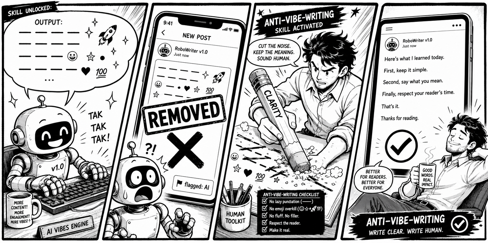

# anti-vibe-writing



[](./README.md)
[](./README.en.md)
[](./LICENSE)
[](./CHANGELOG.md)

> **One goal: make AI sound genuinely idiomatic, 倍儿地道.**

An agent writing skill that removes the AI-generated feel from documents. Works in English and Chinese, with optional modes for matching a specific author's voice.

It runs best as a final pass after drafting with Claude Code, Codex, or any LLM-backed agent. The goal is not to make the prose prettier. The goal is to keep the substance and remove the tells: templated phrasing, vague abstraction, consultant-speak, markdown-heavy formatting, over-structured outlines, and the cautious over-balancing that makes writing feel assembled.

If the default "clean" mode is not enough, the skill also supports:
- **Human-texture mode**: inject controlled irregularities (inversions, particles, half-sentences, non-standard punctuation) for personal voice
- **Learning mode**: build a reusable host profile from real samples so future drafts sound like the person who would write them
- **Scenario presets**: format and tone constraints tuned for tweets, Weibo, blogs, podcast show notes, and professional reports

## Quick start

At its core this is just a set of markdown rules (`SKILL.md` + `references/` + `assets/`), not tied to any one agent. Claude Code, Codex, Kimi, work-buddy, Hermes. If it can read files or take an instruction prompt, it can use this.

**1. Get the rules**

Clone the repo, or just copy the `skills/anti-vibe-writing/` folder:

```bash
git clone https://github.com/weijt606/anti-vibe-writing.git
```

**2. Feed it to your agent (pick whichever fits)**

- **Simplest: just hand it the repo link.** No need to clone first: send `https://github.com/weijt606/anti-vibe-writing` and let the agent read `SKILL.md` and `references/` and configure itself. Works with any agent that can browse the web or run git.
- **One-off (any agent)**: open `skills/anti-vibe-writing/assets/rewrite-prompt-template.md`. It has ready-made instruction blocks: Full Rewrite / Light Cleanup in English, and "中文改写（带负向约束）" for Chinese. Copy the block for your language and send it with your draft.
- **Persistent**: put `SKILL.md` and the matching `references/*patterns-to-remove.md` wherever your agent loads context. Names differ by tool:
  - Agents with a skills directory (e.g. Claude Code): drop it in `~/.claude/skills/anti-vibe-writing/`, then call `/anti-vibe-writing`
  - Agents with a project-instructions file (e.g. Codex's `AGENTS.md`): write or include the rules there
  - Otherwise: paste into the system prompt / custom instructions / knowledge base

**3. (Optional) Name the scenario and mode**

One line of context changes the result a lot:
- Scenario: "this is a tweet / a newsletter / a technical memo"
- Loosen up: "make it feel personal" / "blog voice" → enables human-texture mode
- Match a voice: paste a few of your own samples and say "learn my style" → enables learning mode

When in doubt, say nothing. The default clean mode is right for most drafts.

## Quick examples

Curated before/after snippets live in [examples/](./examples/) for anyone scanning the repo. The full regression set stays under `references/`.

## Voice modes

The skill runs in one of three modes:

| Mode | When to use | Triggered by |
|---|---|---|
| Default (clean) | Most product, docs, and professional copy | Default, no opt-in needed |
| Human texture | Personal blogs, founder notes, social posts | "Loosen it up" / "blog voice" / "make it feel personal" |
| Learning mode | Series content, personal newsletters, voice-consistent comms | User provides samples, or asks "learn my style" |

Modes combine with scenario presets (tweet / Weibo / blog / podcast / report). Conflict resolution rules are documented in `SKILL.md`.

Human-texture mode also has a **social-only "casual typing" (随手打) layer** (off by default; turn it on by naming it, "casual typing" / "开随手打", or describing the effect, "like a quick phone post"; matched by intent, not a fixed phrase, and a plain "loosen it up" won't trigger it): a tiny amount of phone-typing texture on casual posts (dropped end punctuation, no capitalization, an omitted particle) that **never touches numbers, names, or links** and never makes meaning-changing typos. It's phone-typing texture, not error injection to dodge AI detectors.

## Use cases

**The flagship case: Chinese posts on X.** Chinese AI-smell is most obvious on X: 赋能 / 打通, 首先 / 其次, three-clause parallelism, and machine-translation syntax give it away at a glance. This skill is built for exactly that: take an "obviously AI-written" Chinese post and make it read like something a person actually typed. See [`examples/07-tweet-zh.md`](./examples/07-tweet-zh.md) and [`examples/08-translationese-zh.md`](./examples/08-translationese-zh.md).

Other common cases:

- Social posts (X, Weibo, Jike, RedNote)
- Blogs, newsletters, public WeChat articles
- Podcast show notes and video scripts
- README cleanup
- Product docs and landing page copy
- Proposals, founder notes, technical memos, internal reports

## Output goals

- More human rhythm
- More intentional structure
- Cleaner phrasing
- Stronger voice
- Less AI smell
- Sounds chosen by a person, not assembled by a system

## Repository layout

```text
agents/
  README.md
  anti-vibe-writing-dev.agent.md           # local, gitignored
  anti-vibe-writing-dev.agent.example.md
skills/
  anti-vibe-writing/
    SKILL.md
    references/
      patterns-to-remove.md                # English AI-smell
      chinese-patterns-to-remove.md        # 中文 AI 味
      before-after-benchmarks.md           # English benchmarks
      chinese-before-after.md              # 中文基准
      common-problems-and-fixes.md
      human-passes.md
      human-texture.md                     # Optional irregularity
      learning-mode.md                     # Sample-driven style learning
      scenario-presets.md                  # Per-scenario constraints
    assets/
      final-pass-checklist.md
      rewrite-prompt-template.md
      host-profile-template.md             # Fillable host profile
      style-extraction-prompt.md           # One-shot extraction prompt
examples/
  ...
CHANGELOG.md
CONTRIBUTING.md
README.md                                    # Chinese (default)
README.en.md                                 # English
LICENSE
```

## Working with the files

Skill files are versioned. The developer agent file is local and gitignored by default, so contributors can adjust it without changing the public repository.

To create a local agent file, copy `agents/anti-vibe-writing-dev.agent.example.md` to `agents/anti-vibe-writing-dev.agent.md`.

If you want tool-specific auto-discovery, you may still need to mirror these files into the locations required by the target agent platform.

## Credits & references

This skill stands on the shoulders of several open de-AI / humanizer projects and writeups. The patterns below were studied and adapted into this skill's own structure; the original analysis and wording belong to their authors. Thanks to:

English:
- [blader/humanizer](https://github.com/blader/humanizer): a 30-pattern humanizer skill (MIT). Informed the sentence-level tells: copula avoidance, negative parallelism, synonym cycling, false ranges, signposting, diff-anchored writing.
- [hardikpandya/stop-slop](https://github.com/hardikpandya/stop-slop): AI-slop detection skill (MIT). Source of the optional five-dimension scoring pass (Directness / Rhythm / Trust / Authenticity / Density) in `assets/final-pass-checklist.md`.

中文 / Chinese:
- [op7418/Humanizer-zh](https://github.com/op7418/Humanizer-zh): a 24-pattern Chinese humanizer skill, itself a Chinese adaptation of blader/humanizer (MIT). Informed the copula-"是" avoidance and synonym-cycling tells in the Chinese track.
- ["AI 中文翻译腔" by yage.ai](https://yage.ai/share/ai-chinese-translationese-20260418.html): the analysis of Chinese translationese (物理动作动词写抽象 / 形容词加冒号预判读者 / 抽象名词主语). Informed the 翻译腔层 of `references/chinese-patterns-to-remove.md`.
- [@dotey on X](https://x.com/dotey/status/2022774029220749538): discussion of de-AI prompt techniques (role-setting, negative constraints) that shaped the 改写心态 section and the Chinese rewrite prompt block.

These are independent projects with their own scope; this repo borrows ideas, not code. If you maintain one of them and want a credit adjusted, open an issue.

## Contributing

See [CONTRIBUTING.md](./CONTRIBUTING.md) for how to add new patterns, benchmarks, or scenario presets.

## License

This project is open source under the MIT License. See `LICENSE`.

## Contributor notes

- Preserve meaning. Sharpen the writing without changing facts.
- Prefer concrete edits over generic style advice.
- Keep structure only when it helps the reader.

## Version highlights

**1.6.0**
- The final checklist is now a step you run, not a list you glance at: after rewriting, work through `final-pass-checklist.md`, fix only the flagged spots, re-check, and stop after at most two rounds. It's the lightest form of a generate → check → revise loop. One model, one conversation, no extra agents, still just markdown
- New deterministic gate: a one-line `grep` at the bottom of the checklist catches the *exact* tells self-review skims past (em-dash `—`, the `…` character, stray `→ •` in prose, and a fast subset of the jargon list). Shared double curly quotes `“ ”` are left to human judgment by language, so Chinese full-width quotes aren't deleted by mistake
- Learning mode gains a closing check: compare the output's sentence rhythm and punctuation against the numbers recorded in the host profile, and nudge it back if it drifted
- New banned-sentence-structure coverage in the Chinese track (the gaps that weren't covered before): template openers ("在这个 XX 的时代…", the preachy "记住，真正重要的是…"), the "以前…现在…" time-contrast frame, the "总之 / 归根结底 / 说到底" summary-closer, plus 鸡汤/slogan endings and the slick all-correct-but-empty conclusion. Synced into the Chinese rewrite-prompt block and the deterministic gate. Items already covered (不是…而是, 值得注意的是, 让我们 openers, per-paragraph subheadings) were left as-is, not duplicated

**1.5.0**
- New typographic-tells layer targeting the signals readers, platforms (Reddit and others), and detectors catch first: the em-dash (`—` / `——`), en-dash connectors, smart quotes `“ ” ‘ ’`, the `…` character, and stray `→ • ·` in prose. Replace each by the job it does (period, comma, colon, parentheses, straight quotes) while leaving Chinese full-width quotes alone
- New format-forms mapping: swaps the AI *layout* habits (scattered bolding, a heading per short chunk, bullets where a sentence works, `1. 2. 3.` frameworks, `> callouts`, `---` rules, tables for 2–3 items) for the plainest thing a person actually types. Rule of thumb: if you wouldn't type the formatting into a message to a friend, cut it
- Human-texture mode reconciled: the em-dash used to be a "personal voice" signal, but AI now overuses it into a tell, so it's downgraded to rare-and-deliberate with parenthesis/period alternatives
- Stated plainly: stripping these symbols is not a trick to dodge a detector. It makes the text genuinely read like keyboard typing, and lower false-positive flags are just a side effect
- A sixth scenario preset: Reddit / English forum comments. Comment-as-genuine-help constraints, a hard "no em-dashes at all" rule (some subreddit automods flag em-dash density and auto-remove comments as low-effort/AI), break too-symmetric "it's not X, it's Y" parallelism, casual connectors, plus disclosure / anti-sock-puppet guardrails
- New example `10`: an em-dash / typographic-tell before-after in both English and Chinese

**1.4.0**
- Human-texture mode gains a "casual typing" (随手打) layer: a social-only, default-off, hard-guardrailed sliver of phone-typing texture (dropped punctuation / no caps / omitted particle), never on numbers or names, never meaning-changing typos, and not for dodging detectors

**1.3.0**
- A sharper Chinese track for more idiomatic (地道) output: a 翻译腔 / 欧化句式 layer (被字句, 作为一个…, 不仅…而且…, 对…进行…, 复数"们"), a 四字成语 overuse rule, and a 改写心态 section that swaps the 资深文案 / 营销专家 stance for a friend / 公众号 editor / journalist voice
- New sentence-level English tells (copula avoidance, negative parallelism, synonym cycling, false ranges, signposting, diff-anchored writing), adapted from open humanizer projects (see Credits)
- Three new examples: a Chinese X/Twitter post (`07`), a Chinese translationese demo (`08`), and an English sentence-tells demo (`09`)
- A ready-to-use "中文改写（带负向约束）" prompt block in `assets/rewrite-prompt-template.md`, plus an optional five-dimension scoring pass in the final-pass checklist

**1.2.0**
- Chinese AI-smell rules and Chinese before/after benchmarks (`references/chinese-*.md`)
- Human-texture mode for opt-in irregularity (`references/human-texture.md`)
- Learning mode with host profile workflow (`references/learning-mode.md`)
- Five scenario presets: X / Weibo / blog / podcast / report (`references/scenario-presets.md`)
- Host profile template and one-shot style extraction prompt
- Fixed `tools:` field in SKILL.md to use Claude Code's real tool names

See [CHANGELOG.md](./CHANGELOG.md) for the full version history.
